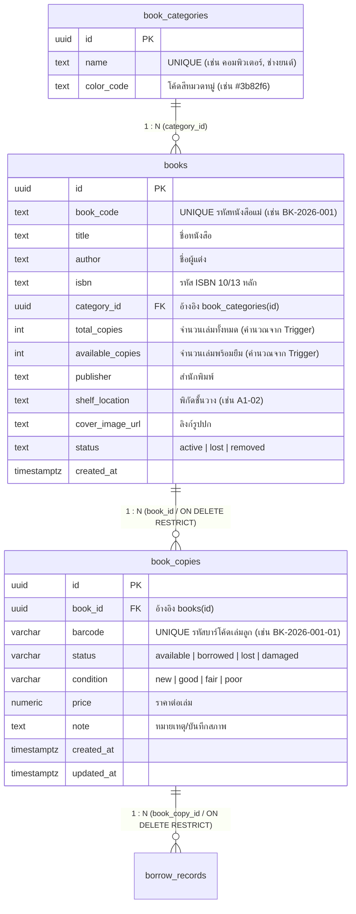
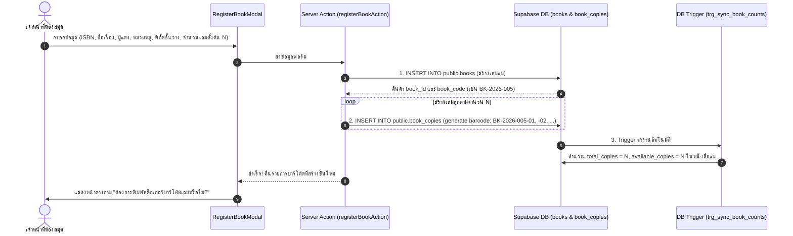
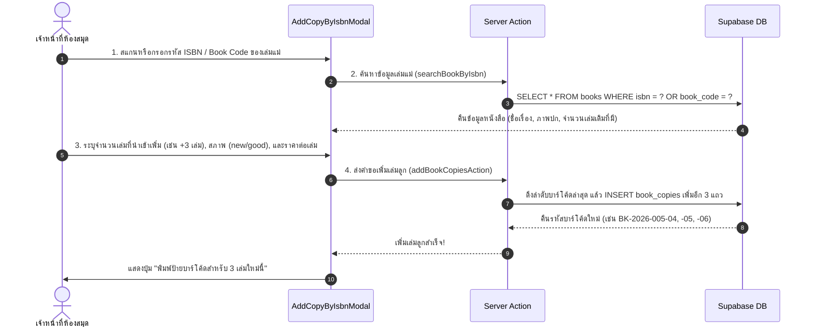

# เอกสารการออกแบบและสถาปัตยกรรมระบบจัดการหนังสือสำหรับเจ้าหน้าที่
## Staff Book Management System (`/staff/books`) — ANT E-Library

> **ฉบับปรับปรุงล่าสุด:** 2026-07-26  
> **สถานะระบบ:** เอกสารการออกแบบสถาปัตยกรรมและการเชื่อมโยงข้อมูลเชิงลึก (System & Database Design Specification)

---

## 1. ภาพรวมระบบและวัตถุประสงค์ (System Overview & Objectives)

ระบบจัดการหนังสือสำหรับเจ้าหน้าที่ (`/staff/books`) เป็นโมดูลหลักของระบบ **ANT E-Library** วิทยาลัยเทคนิคอำนาจเจริญ มีหน้าที่รองรับการบริหารจัดการทรัพยากรสารสนเทศในห้องสมุด ตั้งแต่การลงทะเบียนหนังสือเล่มแม่ (Master Books), การแตกเล่มลูกสำหรับติดบาร์โค้ดจริง (Book Copies), การเพิ่มจำนวนเล่มลูกผ่านการสแกนค้นหา ISBN, การจัดการหมวดหมู่หนังสือ (Book Categories) ไปจนถึงการออกป้ายสติ๊กเกอร์บาร์โค้ด (Barcode Label Sticker Printing) เพื่อนำไปใช้งานในระบบยืม-คืนต่อไป

### วัตถุประสงค์หลัก
1. **การดูและจัดการรายการหนังสือรวม (Centralized Cataloging):** แสดงรายการหนังสือเล่มแม่ทั้งหมด พร้อมสถานะจำนวนเล่มรวม (`total_copies`) และจำนวนเล่มคงเหลือที่พร้อมให้ยืม (`available_copies`) 
2. **การลงทะเบียนหนังสือใหม่แบบอัตโนมัติ (Master Book & Automatic Copy Splitting):** ลงทะเบียนหนังสือเล่มแม่เพียงครั้งเดียว และให้ระบบสร้างเล่มลูกพร้อมรหัสบาร์โค้ด (เช่น `BK-0001-01`, `BK-0001-02`) ให้อัตโนมัติทันทีตามจำนวนเล่มที่นำเข้า
3. **การเพิ่มเล่มลูกจาก ISBN เดิม (Add Copies via ISBN Lookup):** เมื่อมีหนังสือชื่อเรื่องเดิมเข้ามาเพิ่ม เจ้าหน้าที่สามารถสแกน/กรอกรหัส ISBN เพื่อค้นหาเล่มแม่ แล้วระบุจำนวนเล่มที่นำเข้าเพิ่มได้อย่างรวดเร็ว
4. **ระบบพิมพ์ป้ายสติ๊กเกอร์บาร์โค้ด (Printable Barcode Label Generator):** สร้างสติ๊กเกอร์บาร์โค้ดมาตรฐาน (Code128) พร้อมชื่อเรื่อง, รหัสบาร์โค้ด, พิกัดชั้นวาง (`shelf_location`) จัดเรียงเลย์เอาต์พร้อมสั่งพิมพ์ผ่านเบราว์เซอร์หรือเครื่องพิมพ์สติ๊กเกอร์ทันที
5. **ความสมบูรณ์ของข้อมูลการยืม-คืน (Data Audit Trail & Integrity):** ใช้โครงสร้างฐานข้อมูลที่มี Trigger คำนวณจำนวนเล่มอัตโนมัติ และป้องกันการลบข้อมูลประวัติแบบ CASCADE ด้วยกฎ `ON DELETE RESTRICT`

---

## 2. การเชื่อมโยงโครงสร้างฐานข้อมูล (Database Schema & Entity Relationship)

ระบบผูกเชื่อมกับ 3 ตารางหลักใน PostgreSQL / Supabase ได้แก่ `book_categories`, `books`, และ `book_copies` ร่วมกับ Trigger อัตโนมัติ ดังแสดงในแผนภาพความสัมพันธ์ด้านล่าง:

### 2.1 แผนภาพความสัมพันธ์ (ER Diagram & Triggers)



### 2.2 กลไกการทำงานของ Database Trigger อัตโนมัติ (`trg_sync_book_counts`)

ในสคริปต์ `001_init_schema.sql` มีการติดตั้ง Trigger ฟังก์ชั่น `trg_sync_book_counts()` เพื่อดูแลความถูกต้องของข้อมูลเล่มแม่และเล่มลูก ดังนี้:

1. **เมื่อมีการ INSERT เล่มลูก (`book_copies`):**  
   Trigger จะทำการนับจำนวนแถวใน `book_copies` ทั้งหมดที่มี `book_id` ตรงกัน แล้วอัปเดตค่า `books.total_copies` และจะนับเฉพาะเล่มที่มี `status = 'available'` ไปอัปเดตค่า `books.available_copies` โดยอัตโนมัติ
2. **เมื่อมีการ UPDATE สถานะเล่มลูก (`book_copies.status`):**  
   หากเล่มลูกถูกยืม (`borrowed`), แจ้งสูญหาย (`lost`), หรือชำรุด (`damaged`) Trigger จะลดจำนวน `available_copies` ในตาราง `books` ลงทันที
3. **ข้อจำกัดเรื่องการลบ (`ON DELETE RESTRICT`):**  
   ห้ามลบตาราง `books` หรือ `book_copies` หากมีประวัติการยืมใน `borrow_records` ค้างอยู่ โดยหากต้องการยกเลิกหนังสือ ให้เปลี่ยน `books.status = 'removed'` แทน เพื่อรักษา Audit Trail ของระบบ

---

## 3. สถาปัตยกรรมและการแบ่งส่วนฟังก์ชันการทำงาน (Module Architecture)

ระบบประกอบด้วย 6 ส่วนส่วนการทำงานหลัก (Components) ที่ทำงานประสานกันผ่าน Next.js App Router และ Supabase Client:

```
web/app/staff/books/
├── page.tsx                           # หน้าหลัก (Master-Detail View + Stat Cards + Filters)
├── actions.ts                         # Server Actions (สร้างหนังสือ, เพิ่มเล่มลูก, จัดการหมวดหมู่)
└── components/
    ├── book-stat-cards.tsx            # แผงสถิติรวม (ยอดชื่อเรื่อง, เล่มรวม, พร้อมยืม, ชำรุด/หาย)
    ├── book-table.tsx                 # ตารางหนังสือหลัก (Master Books List)
    ├── register-book-modal.tsx        # ฟอร์มลงทะเบียนหนังสือใหม่ (Master + Initial Copies)
    ├── add-copy-by-isbn-modal.tsx     # ฟอร์มค้นหา ISBN เพื่อเพิ่มเล่มลูก (Add Copies by ISBN)
    ├── book-copies-drawer.tsx         # หน้าต่างจัดการเล่มลูก (View/Edit Barcode Copies & Status)
    ├── category-manager-modal.tsx     # หน้าต่างบริหารจัดการหมวดหมู่ (Category CRUD)
    └── barcode-print-modal.tsx        # ตัวแสดงผลและสั่งพิมพ์สติ๊กเกอร์บาร์โค้ด (Code128 Print Engine)
```

---

## 4. รายละเอียดฟังก์ชันและขั้นตอนการทำงาน (Detailed Workflows & User Journeys)

### 4.1 ฟังก์ชันการดูและกรองรายการหนังสือ (Catalog View & Search Filter)

*   **Stat Cards (แผงสรุปสถิติ):**
    *   **จำนวนชื่อเรื่องทั้งหมด:** นับจำนวนแถวใน `books` ที่มี `status = 'active'`
    *   **รวมจำนวนหนังสือทั้งหมด:** ผลรวม `SUM(total_copies)`
    *   **พร้อมใช้งาน/ยืมได้:** ผลรวม `SUM(available_copies)`
    *   **ชำรุด / สูญหาย:** จำนวนเล่มลูกใน `book_copies` ที่มีสถานะ `damaged` หรือ `lost`
*   **Search & Filter Toolbar:**
    *   **ค้นหาอัจฉริยะ (Smart Search):** ค้นหาแบบเรียลไทม์รองรับ ชื่อเรื่อง (`title`), ผู้แต่ง (`author`), ISBN (`isbn`), รหัสหนังสือ (`book_code`), และพิกัดชั้นวาง (`shelf_location`)
    *   **ตัวกรองหมวดหมู่ (Category Filter):** เลือกกรองตามหมวดหมู่ พร้อมแสดง Badge สีประจำหมวด (`color_code`)
    *   **ตัวกรองสถานะเล่ม (Availability Filter):** กรองเฉพาะหนังสือที่มีเล่มพร้อมยืม หรือเล่มที่หมด

---

### 4.2 ฟังก์ชันลงทะเบียนหนังสือแม่ใหม่ (Register Master Book + Initial Copies)

เมื่อเจ้าหน้าที่กดปุ่ม **"+ ลงทะเบียนหนังสือใหม่"**:



#### กฎการสร้างรหัสบาร์โค้ดอัตโนมัติ (Barcode Generation Rule):
- รูปแบบบาร์โค้ดเริ่มต้น: `{book_code}-{ลำดับเล่มลูกสองหลัก}`
- ตัวอย่าง: หนังสือรหัส `BK-2026-012` จำนวน 3 เล่ม จะได้บาร์โค้ด:
  1. `BK-2026-012-01`
  2. `BK-2026-012-02`
  3. `BK-2026-012-03`
- *หมายเหตุ:* เจ้าหน้าที่สามารถสแกนบาร์โค้ดสติ๊กเกอร์เดิมที่มีอยู่แล้วทับค่ารหัสอัตโนมัติได้หากต้องการ

---

### 4.3 ฟังก์ชันเพิ่มเล่มลูกผ่านการสแกน/ค้นหา ISBN (Add Copies via ISBN Lookup)

ตามความต้องการเฉพาะของงานห้องสมุด เมื่อมีหนังสือชื่อเรื่องเดิมที่เคยลงทะเบียนไว้นำเข้าเพิ่ม:



---

### 4.4 ฟังก์ชันจัดการเล่มลูกและสภาพหนังสือ (Book Copies Drawer)

เมื่อคลิกเลือกหนังสือเล่มใดเล่มหนึ่งในตาราง หน้าต่าง Drawer ด้านข้างจะสไลด์ออกมาแสดงรายละเอียดเล่มลูกทั้งหมด:

*   **ตารางเล่มลูก (Copies Table):**
    *   **รหัสบาร์โค้ด (Barcode):** แสดงรหัสพร้อมปุ่มคัดลอก/พิมพ์สติ๊กเกอร์รายเล่ม
    *   **สถานะเล่ม (Status Badge):**
        *   🟢 `available` (พร้อมยืม)
        *   🔵 `borrowed` (ถูกยืมอยู่) — แสดงชื่อผู้ยืมและวันกำหนดคืน
        *   🔴 `lost` (สูญหาย)
        *   พัสดุชำรุด `damaged` (ชำรุด)
    *   **สภาพหนังสือ (Condition Selector):** ตัวเลือกปรับสภาพ (`new`, `good`, `fair`, `poor`)
    *   **หมายเหตุ (Note):** ช่องบันทึกรายละเอียด (เช่น "หน้า 12-15 มีรอยขีดเขียน", "ปกหลังฉีกขาด")
    *   **ราคา (Price):** ราคาต่อเล่มสำหรับคิดค่าปรับกรณีทำสูญหาย

---

### 4.5 ฟังก์ชันจัดการหมวดหมู่หนังสือ (Category Management Modal)

*   เปิดหน้าต่างจัดการหมวดหมู่ `book_categories`
*   สามารถ **เพิ่ม (Create)**, **แก้ไข (Update)**, หรือ **ลบ (Delete)** หมวดหมู่ได้
*   กำหนด **โค้ดสีประจำหมวด (Color Code)** เช่น สีฟ้า `#3b82f6` สำหรับหมวดคอมพิวเตอร์ เพื่อนำไปแสดงเป็น Badge สีสันสวยงามบนตารางและป้ายบาร์โค้ด

---

### 4.6 ฟังก์ชันออกป้ายสติ๊กเกอร์บาร์โค้ด (Printable Barcode Label Generator)

ระบบมีเอนจินสำหรับสร้างแท็กบาร์โค้ด Code128 ผ่าน SVG/HTML5 โดยไม่ต้องพึ่งพาแอปพลิเคชันภายนอก:

#### โครงสร้างแท็กสติ๊กเกอร์ 1 ดวง (Barcode Label Layout):
```
+---------------------------------------------------+
|  วิทยาลัยเทคนิคอำนาจเจริญ E-LIBRARY                 |
|                                                   |
|  [|||||||||||||||||||||||||||||||||||||||||||||]  |  <- Barcode Code128 (SVG)
|                   BK-2026-005-01                  |  <- Barcode Text
|                                                   |
|  ชื่อเรื่อง: คู่มือเขียนโปรแกรม Python               |
|  หมวด: คอมพิวเตอร์      ชั้นวาง: A1-02             |
+---------------------------------------------------+
```

#### คุณสมบัติการพิมพ์:
1. **จัดเลย์เอาต์ตามขนาดกระดาษสติ๊กเกอร์ (Sticker Grid Layout):** รองรับกระดาษสติ๊กเกอร์ A4 (เช่น แบบ 3x7 ดวง = 21 ดวงต่อแผ่น) หรือเครื่องพิมพ์สติ๊กเกอร์ความร้อน (Thermal Label Printer)
2. **การสั่งพิมพ์ (Print CSS Directive):** มีการตั้งค่า `@media print` ซ่อนเมนูและปุ่มควบคุมอื่น ๆ ของเว็บ ให้เหลือเฉพาะแผ่นสติ๊กเกอร์บาร์โค้ดอย่างเดียวเมื่อกด `Ctrl+P` หรือกดปุ่ม "สั่งพิมพ์"

---

## 5. สเปกไฟล์และโครงสร้างซอร์สโค้ดที่จะสร้าง (Implementation Code Structure)

### 5.1 โครงสร้างไฟล์ในโปรเจกต์ Next.js

```
web/
├── app/
│   └── staff/
│       └── books/
│           ├── page.tsx                           # UI หลักของ /staff/books
│           └── actions.ts                         # Server Actions สำหรับจัดการข้อมูล
└── utils/
    └── barcode-generator.ts                       # Utility สร้างรหัส SVG Barcode (Code128)
```

### 5.2 รายละเอียดโค้ดสำคัญแต่ละส่วน

#### A. Server Actions (`web/app/staff/books/actions.ts`)
ประกอบด้วยฟังก์ชั่นหลัก:
1. `getBooksAction(filters)` — ดึงรายการหนังสือแม่พร้อม JOIN หมวดหมู่และนับเล่มลูก
2. `registerBookAction(formData)` — สร้างหนังสือแม่ + สร้างเล่มลูก N เล่มแรกใน Transaction เดียวกัน
3. `addBookCopiesByIsbnAction(isbnOrCode, count, condition, price)` — ค้นหาเล่มแม่จาก ISBN แล้วสร้างเล่มลูกเพิ่ม
4. `updateBookCopyStatusAction(copyId, status, condition, note)` — ปรับปรุงสถานะ/สภาพเล่มลูก
5. `manageCategoryAction(type, data)` — เพิ่ม/แก้ไข/ลบ หมวดหมู่หนังสือ

#### B. Printable Barcode Utility (`web/utils/barcode-generator.ts`)
ใช้ไลบรารีสร้างรหัสบาร์โค้ด Code128 ที่ได้มาตรฐาน สามารถสแกนด้วยเครื่องสแกนบาร์โค้ด USB/Bluetooth ทั่วไปได้ทันที

---

## 6. สรุปขั้นตอนการนำไปติดตั้งใช้งาน (Deployment & Roadmap)

1. **ฐานข้อมูล (Database):** โครงสร้างตารางและ Trigger พร้อมใช้งานแล้วใน `supabase/migrations/001_init_schema.sql`
2. **การสร้างส่วนติดต่อผู้ใช้ (UI Implementation):** สร้างส่วนประกอบใน `web/app/staff/books/` ตามโครงสร้างที่ออกแบบข้างต้น
3. **การทดสอบการยืม-คืน (Integration):** รหัสบาร์โค้ดเล่มลูก (`book_copies.barcode`) ที่สร้างจากโมดูลนี้ จะถูกนำไปใช้สแกนในหน้ายืม-คืนหนังสือของเจ้าหน้าที่ (`/staff/borrow`) และหน้าตรวจสอบประวัติยืมคืนต่อไป
